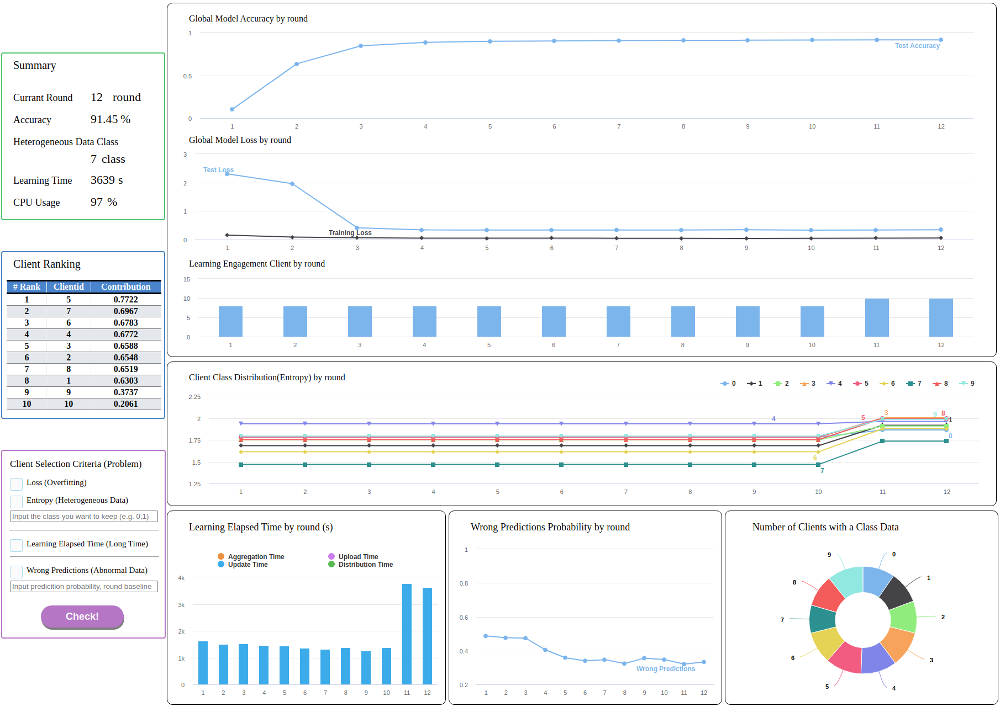

# FLDashboard
Federated Learning Dashboard (FLDashboard). <br>
This dashboard was created to monitor and directly manage the performance of federated learning models. <br>
Information required for the dashboard is stored and used in the ```sqlite3``` database, indicating that it is still an early version. <br>

## Location
- FLDashboard is <b>located in the same environment as the server</b> and is a tool for federated learning administrators.

## Database
- index.db (Save the unique name of the client participating in federated learning by matching the index.)
```
CREATE TABLE ClientID (
    id INTEGER AUTO_INCREMENT PRIMARY KEY,
    clientname TEXT NOT NULL UNIQUE);
```
- learning.db (Save all data for performance monitoring.)
```
CREATE TABLE LearningRound (
    round INTEGER NOT NULL,
    clientid INTEGER NOT NULL,
    datasize TEXT NOT NULL,
    classsize TEXT NOT NULL);
CREATE TABLE LearningTime (
    round INTEGER NOT NULL,
    clientid INTEGER NOT NULL,
    uploadstarttime REAL NOT NULL,
    uploadendtime REAL NOT NULL);
CREATE TABLE CPURAMMonitoring (
    round INTEGER NOT NULL,
    clientid INTEGER NOT NULL,
    cpu REAL NOT NULL,
    ram REAL NOT NULL);
CREATE TABLE DistributionTime (
    round INTEGER NOT NULL,
    clientid INTEGER NOT NULL,
    distributiontime REAL NOT NULL);
CREATE TABLE AggregationTime (
    round INTEGER NOT NULL,
    aggregationtime REAL NOT NULL);
CREATE TABLE LearningTrain (
    round INTEGER NOT NULL,
    clientid INTEGER NOT NULL,
    accuracy REAL NOT NULL,
    loss REAL NOT NULL,
    tloss REAL NOT NULL,
    trainingtime REAL NOT NULL);
CREATE TABLE Predictions (
    round INTEGER NOT NULL,
    clientid INTEGER NOT NULL,
    prediction REAL NOT NULL);
```

## Client Data for Performance Monitoring
- Description of the data to be stored in the database.

|Data|Data Type|Database-Table|Description|
|:--:|:--:|:--:|:--:|
|client name|string|index-ClientID|Client name participating in learning.|
|data size|int32|learning-LearningRound|Data size by class.|
|class size|int32|learning-LearningRound|Class size by round.|
|test accuracy|float|learning-LearningTrain|Model test accuracy.|
|test loss|float|learning-LearningTrain|Model test loss.|
|train loss|float|learning-LearningTrain|Model train loss.|
|aggregation time|float|learning-AggregationTime|Model aggregation time.|
|upload end time|float|learning-LearningTime|Model upload end time.|
|upload start time|float|learning-LearningTime|Model upload start time.|
|update time|float|learning-LearningTrain|Model training time.|
|distribution time|float|learning-DistributionTime|Model distribution time.|

## Performance Monitoring Interface

